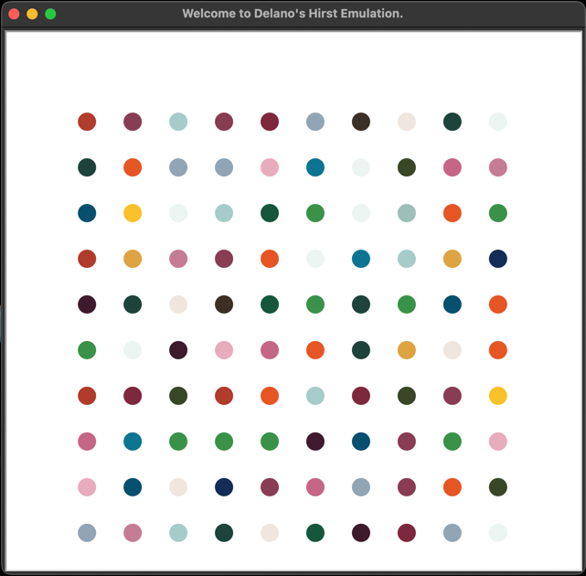

# Hirst-Emulation

This is a program that generates a digital rendition of Damien Hirst's famous "Spots" artwork.

## Table of Contents

- [Technologies](#technologies)
- [Status](#status)

## Technologies
- Python 3.10
- Turtle module for Python

## Status
Completed